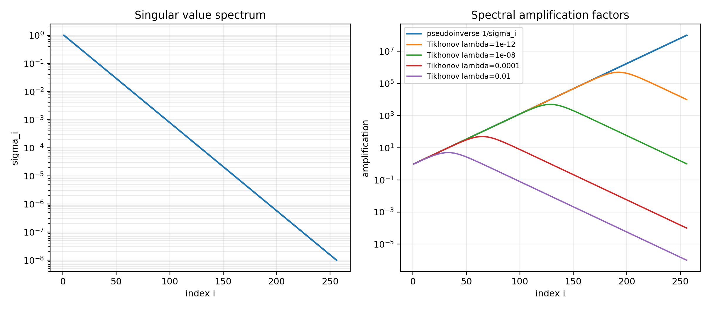
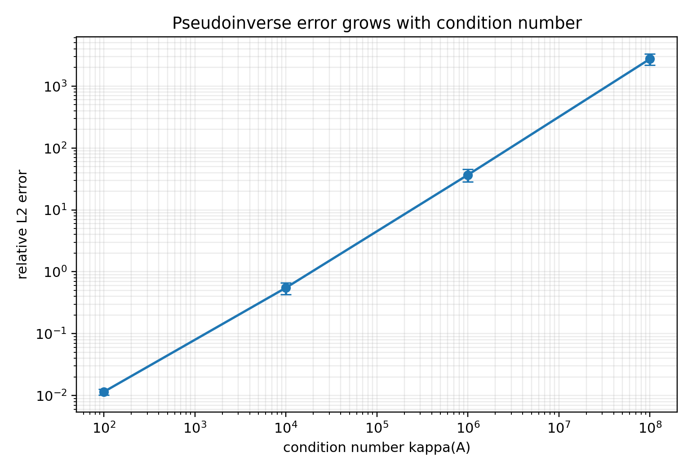
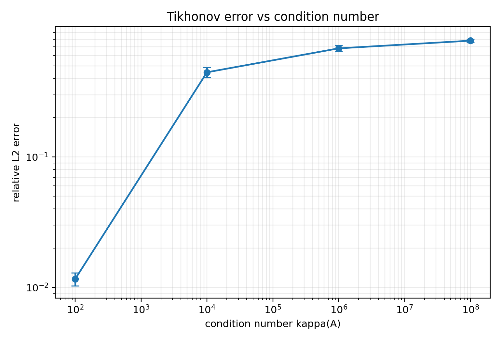
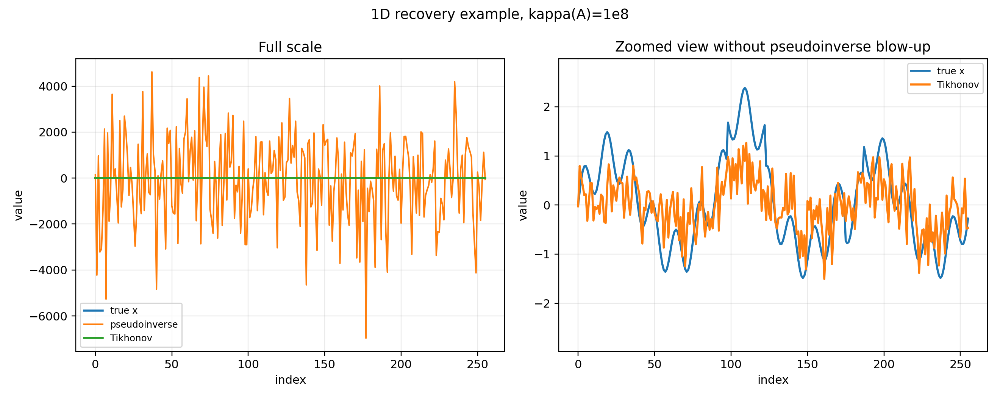
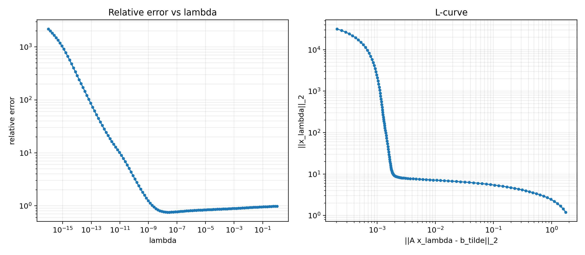
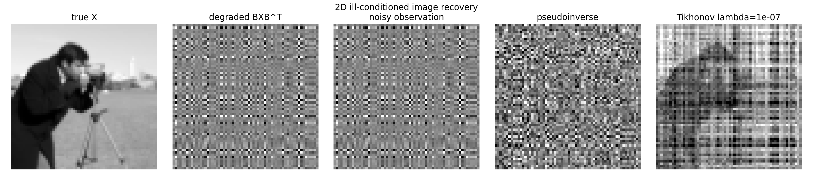
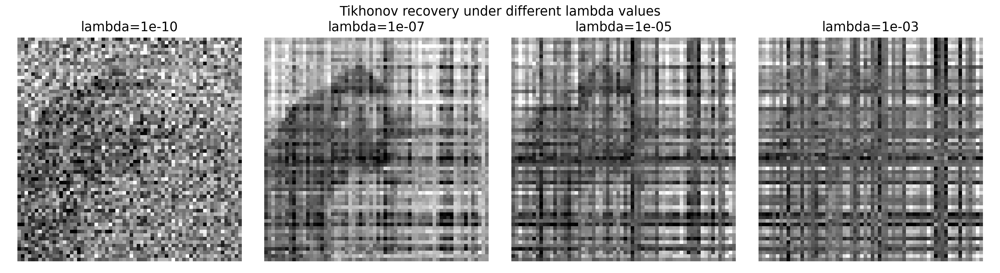

# 病态线性算子的误差放大与 Tikhonov 正则化

课程：工科高等代数（二）  
课题：病态算子构造与正则化  
小组成员：刘丰源、黄子涵、李昊峰  
日期：2026 年 5 月

## 摘要

病态线性系统广泛存在于信号处理、图像复原、反问题和数值计算中。此类问题的核心困难在于：观测数据中很小的扰动可能在求解过程中被显著放大，从而导致恢复结果严重偏离真实解。本文从高等代数中的奇异值分解出发，构造了一类条件数可控的病态线性算子，系统研究了伪逆求解中的误差放大现象，并引入 Tikhonov 正则化方法进行稳定恢复。

理论部分首先利用奇异值分解表示矩阵 $A=U\Sigma V^T$，说明病态性的来源是奇异值谱的快速衰减。当观测数据受到扰动 $\delta b$ 时，伪逆解中的误差项可写为 $A^+\delta b$，其在奇异向量基下包含放大因子 $1/\sigma_i$。因此，小奇异值方向上的噪声会被显著放大。随后，本文推导 Tikhonov 正则化解，并说明其在奇异值方向上将伪逆放大因子 $1/\sigma_i$ 替换为 $\sigma_i/(\sigma_i^2+\lambda)$，从而抑制小奇异值方向上的噪声放大。

实验部分包括一维信号实验和二维图像复原实验。一维实验表明，当条件数从 $10^2$ 增加到 $10^8$ 时，伪逆恢复的平均相对误差由 0.0115 增加到 2741.0088，而 Tikhonov 正则化恢复的平均相对误差维持在 0.7791 以下。二维图像实验进一步表明，在向量化算子条件数达到 $10^6$ 的情况下，伪逆恢复的 Frobenius 相对误差为 5.1718，而最佳 Tikhonov 恢复结果的 Frobenius 相对误差为 0.5332。理论分析与实验结果一致说明：病态问题中的主要困难来自小奇异值方向的噪声放大，而 Tikhonov 正则化可以通过谱滤波机制显著提高求解稳定性。

**关键词**：奇异值分解；病态矩阵；条件数；伪逆；Tikhonov 正则化；谱滤波；误差放大

## 1. 引言

在线性代数和数值计算中，线性方程组是最基本的问题之一。给定矩阵 $A$ 和观测向量 $b$，通常希望求解未知向量 $x$，使得：

$$
b = Ax
$$

在理想情况下，如果 $A$ 可逆，则可以通过 $x=A^{-1}b$ 得到唯一解；如果 $A$ 不是方阵或不满秩，也可以借助最小二乘和 Moore-Penrose 伪逆求得某种意义下的最优解。然而，在实际问题中，观测数据通常不可避免地包含噪声。实际得到的往往不是 $b$，而是：

$$
\tilde b = Ax + \delta b
$$

其中 $\delta b$ 表示观测扰动。此时，即使 $\delta b$ 很小，恢复出的 $\hat x$ 也可能与真实解 $x$ 相差很大。这一现象并非由计算程序错误造成，而是由矩阵 $A$ 本身的谱结构决定。

若矩阵 $A$ 的条件数很大，则称相关线性系统是病态的。病态系统的特点是对输入扰动高度敏感，小的观测误差可能导致大的解误差。如何从高等代数角度理解这种误差放大机制，并设计稳定的求解方法，是本文关注的核心问题。

本文选择“病态算子构造与正则化”作为研究课题，主要目标包括：

1. 构造条件数可控的病态线性算子；
2. 通过奇异值分解分析伪逆求解的误差放大机制；
3. 推导 Tikhonov 正则化解，并解释其谱滤波作用；
4. 通过一维信号与二维图像实验验证理论分析；
5. 分析正则化参数 $\lambda$ 对恢复效果的影响。

本文的研究重点不是单纯完成图像或信号去噪，而是借助信号与图像数据，把抽象的线性代数现象可视化和量化，从而展示奇异值分解、条件数、伪逆和正则化之间的内在联系。

## 2. 理论基础

### 2.1 线性观测模型

设真实数据为向量 $x\in\mathbb{R}^n$，线性观测过程由矩阵 $A\in\mathbb{R}^{m\times n}$ 表示。理想观测模型为：

$$
b = Ax
$$

实际观测通常含有扰动：

$$
\tilde b = Ax + \delta b
$$

其中 $\delta b$ 表示观测噪声。研究目标是在已知 $A$ 和 $\tilde b$ 的情况下恢复 $x$。

若直接使用伪逆求解，则恢复结果为：

$$
\hat x_{\mathrm{pinv}} = A^+\tilde b
$$

若暂时假设 $A^+A$ 对真实解方向的作用近似为单位作用，则误差主要来自：

$$
\hat x_{\mathrm{pinv}} - x \approx A^+\delta b
$$

因此，病态问题的关键在于分析 $A^+$ 如何作用于扰动 $\delta b$。

### 2.2 奇异值分解

任意矩阵 $A\in\mathbb{R}^{m\times n}$ 都可以作奇异值分解：

$$
A = U\Sigma V^T
$$

其中 $U$ 和 $V$ 是正交矩阵，$\Sigma$ 是由非负奇异值组成的对角型矩阵。设 $A$ 的非零奇异值为：

$$
\sigma_1\geq\sigma_2\geq\cdots\geq\sigma_r>0
$$

奇异值分解可以理解为：矩阵 $A$ 所代表的线性变换等价于先进行正交坐标变换，再沿各个正交方向进行不同程度的伸缩，最后再进行一次正交坐标变换。由于正交变换保持向量长度，矩阵的伸缩性质主要由奇异值决定。

### 2.3 条件数与病态性

矩阵 $A$ 的 2-范数条件数定义为：

$$
\kappa(A)=\frac{\sigma_1}{\sigma_r}
$$

其中 $\sigma_1$ 为最大奇异值，$\sigma_r$ 为最小非零奇异值。若 $\kappa(A)$ 很大，则说明 $A$ 在某些方向上伸缩很强，而在另一些方向上压缩很强。反向求解时，被压缩的方向需要被重新放大，因此这些方向上的噪声也会被放大。

条件数越大，线性系统对扰动越敏感。在数值计算中，条件数是判断线性问题稳定性的重要指标。

### 2.4 Moore-Penrose 伪逆

设 $A=U\Sigma V^T$，则其 Moore-Penrose 伪逆为：

$$
A^+ = V\Sigma^+U^T
$$

其中：

$$
\Sigma^+ = \mathrm{diag}\left(\frac1{\sigma_1},\frac1{\sigma_2},\dots,\frac1{\sigma_r}\right)
$$

由此可见，伪逆会把每个非零奇异值 $\sigma_i$ 替换成倒数 $1/\sigma_i$。当某些奇异值很小时，$1/\sigma_i$ 会非常大。

观测扰动经过伪逆后的误差项可展开为：

$$
A^+\delta b = \sum_{i=1}^r \frac{u_i^T\delta b}{\sigma_i}v_i
$$

该公式表明，噪声 $\delta b$ 在左奇异向量 $u_i$ 方向上的分量 $u_i^T\delta b$ 会被 $1/\sigma_i$ 放大，并转化为右奇异向量 $v_i$ 方向上的解误差。当 $\sigma_i$ 极小时，即使 $u_i^T\delta b$ 很小，也可能产生巨大误差。

### 2.5 Tikhonov 正则化

为抑制病态系统中的误差放大，可以引入 Tikhonov 正则化。其基本思想是在拟合观测数据的同时，限制解的范数。Tikhonov 正则化问题定义为：

$$
x_\lambda = \arg\min_x\left(\|Ax-\tilde b\|_2^2+\lambda\|x\|_2^2\right)
$$

其中 $\lambda>0$ 是正则化参数。第一项 $\|Ax-\tilde b\|_2^2$ 表示拟合误差，第二项 $\lambda\|x\|_2^2$ 表示对解范数的惩罚。

对目标函数求极值，可得正规方程：

$$
(A^TA+\lambda I)x_\lambda=A^T\tilde b
$$

由于 $A^TA$ 是半正定矩阵，$\lambda I$ 是正定矩阵，所以当 $\lambda>0$ 时，$A^TA+\lambda I$ 是正定矩阵，从而正则化解唯一存在：

$$
x_\lambda=(A^TA+\lambda I)^{-1}A^T\tilde b
$$

进一步结合奇异值分解，可得：

$$
x_\lambda = \sum_{i=1}^r \frac{\sigma_i}{\sigma_i^2+\lambda}(u_i^T\tilde b)v_i
$$

对照谱滤波解的表达式$x_{\text{滤波}} = \sum_i \phi_i \cdot \frac{u_i^T b}{\sigma_i} v_i$，Tikhonov 正则化中的谱滤波因子为：

$$
g_\lambda(\sigma_i)=\frac{\sigma_i^2}{\sigma_i^2+\lambda}
$$

当 $\sigma_i$ 较小时，$g_\lambda(\sigma_i)$ 趋近于0，从而过滤掉放大噪声的小奇异值通道。因此，Tikhonov 正则化能够抑制小奇异值方向上的噪声放大。

## 3. 病态算子构造

为了系统研究条件数对恢复误差的影响，本文不采用任意矩阵，而是通过奇异值分解构造条件数可控的病态矩阵。设：

$$
A=U\Sigma V^T
$$

其中 $U,V$ 由随机高斯矩阵经 QR 分解生成正交矩阵。奇异值设置为指数衰减形式：

$$
\sigma_i = 10^{-\alpha\frac{i-1}{n-1}},\quad i=1,2,\dots,n
$$

由此可得：

$$
\sigma_1=1,\quad \sigma_n=10^{-\alpha}
$$

因此矩阵条件数为：

$$
\kappa(A)=10^\alpha
$$

本文在一维实验中取：

$$
\kappa(A)\in\{10^2,10^4,10^6,10^8\}
$$

这种构造方式的优点是：矩阵的病态程度完全由参数 $\alpha$ 控制，便于比较不同条件数下伪逆和正则化方法的表现。

## 4. 实验设计

### 4.1 实验环境与可复现性

实验使用 Python 实现，主要依赖包括 `numpy`、`scipy`、`matplotlib`、`pandas` 和 `scikit-image`。项目使用 `uv` 管理依赖，随机实验统一设置随机种子 `20260513`。所有图表和结果文件均由脚本自动生成。

主要复现命令如下：

```powershell
uv sync
uv run python -m experiments.exp_filter_factors
uv run python -m experiments.exp_1d_condition_number
uv run python -m experiments.exp_1d_lambda_selection
uv run python -m experiments.exp_2d_image_recovery
```

实验结果保存于 `results/`，图表保存于 `figures/`。每个实验脚本对应一个明确问题，避免手工修改结果，以保证可复现性。

### 4.2 评价指标

一维信号实验主要使用相对 $L^2$ 误差：

$$
E_x=\frac{\|\hat x-x\|_2}{\|x\|_2}
$$

同时计算误差放大倍数：

$$
M=\frac{\|\hat x-x\|_2/\|x\|_2}{\|\delta b\|_2/\|b\|_2}
$$

二维图像实验使用 Frobenius 相对误差：

$$
E_X=\frac{\|\hat X-X\|_F}{\|X\|_F}
$$

并使用 PSNR 和 SSIM 作为图像质量辅助指标。

其中 PSNR 为峰值信噪比，PSNR 越高，代表恢复后的图像和原图在像素数值上越接近，噪声越小。

SSIM为结构相似性，它模拟了人类视觉系统对物体的亮度、对比度和结构信息的敏感度。SSIM 的范围是 0 到 1，越接近 1，说明两张图片的结构越相似，人眼看起来就越觉得它们是同一张图。

需要注意的是，PSNR 和 SSIM 用于描述视觉质量，而矩阵范数误差更直接反映线性代数意义下的恢复精度。

### 4.3 实验内容

本文共设置四类实验：

1. 奇异值谱与滤波因子实验：比较伪逆放大因子和 Tikhonov 滤波因子；
2. 一维信号条件数实验：研究条件数增大时伪逆和 Tikhonov 的误差变化；
3. 正则化参数扫描实验：研究 $\lambda$ 对恢复误差和 L-curve 的影响；
4. 二维图像复原实验：利用图像数据可视化病态算子的误差放大和正则化恢复效果。

## 5. 实验一：奇异值谱与滤波因子

### 5.1 实验目的

本实验用于直接展示病态矩阵的奇异值谱，以及伪逆和 Tikhonov 正则化在各个奇异值方向上的放大因子差异。

### 5.2 实验设置

取矩阵规模 $n=256$，奇异值衰减参数 $\alpha=8$，对应条件数：

$$
\kappa(A)=10^8
$$

绘制以下曲线：

1. 奇异值谱 $\sigma_i$；
2. 伪逆放大因子 $1/\sigma_i$；
3. Tikhonov 滤波因子 $\sigma_i/(\sigma_i^2+\lambda)$。

图表路径：



### 5.3 结果分析

奇异值谱随序号快速下降，说明矩阵在不同方向上的伸缩差异极大。伪逆放大因子 $1/\sigma_i$ 在小奇异值方向迅速增大，显示出噪声放大的潜在风险。相比之下，Tikhonov 滤波因子在小奇异值方向受到 $\lambda$ 的抑制，不会无限增大。

该实验从谱结构上解释了后续数值实验中的现象：伪逆方法在病态矩阵下容易产生巨大误差，而 Tikhonov 正则化能够抑制这种误差放大。

## 6. 实验二：一维信号条件数实验

### 6.1 实验目的

本实验研究条件数变化对恢复误差的影响。通过构造不同条件数的病态矩阵，比较伪逆解和 Tikhonov 正则化解的稳定性。

### 6.2 实验设置

真实信号维度取 $n=256$。信号由低频正弦、高频正弦和局部突变组成，使其同时具有平滑成分和局部结构。观测模型为：

$$
\tilde b = Ax+\delta b
$$

相对噪声水平设置为：

$$
\rho=\frac{\|\delta b\|_2}{\|Ax\|_2}=10^{-3}
$$

条件数取：

$$
\kappa(A)\in\{10^2,10^4,10^6,10^8\}
$$

每组条件数重复 20 次随机噪声实验，并报告平均误差。

图表路径：







### 6.3 实验结果

一维条件数实验的平均结果如下：

| 条件数 $\kappa(A)$ | 伪逆平均相对误差 | Tikhonov 平均相对误差 | 伪逆平均放大倍数 | Tikhonov 平均放大倍数 |
|---:|---:|---:|---:|---:|
| $10^2$ | 0.0115 | 0.0116 | 11.50 | 11.61 |
| $10^4$ | 0.5507 | 0.4460 | 550.71 | 445.97 |
| $10^6$ | 36.7971 | 0.6807 | 36797.09 | 680.65 |
| $10^8$ | 2741.0088 | 0.7791 | 2741008.84 | 779.15 |

### 6.4 结果分析

当 $\kappa(A)=10^2$ 时，矩阵病态程度较弱，伪逆和 Tikhonov 的相对误差均约为 0.011，二者差异不明显。当条件数增大到 $10^4$ 时，伪逆平均误差上升到 0.5507，说明噪声放大已经开始影响恢复结果。当条件数进一步增大到 $10^6$ 和 $10^8$ 时，伪逆平均误差分别达到 36.7971 和 2741.0088，恢复结果已经严重失真。

相比之下，Tikhonov 正则化在相同条件数下的平均误差分别为 0.6807 和 0.7791，虽然误差也有所增加，但远小于伪逆方法。这说明正则化方法通过抑制小奇异值方向的放大，提高了病态系统下的恢复稳定性。

一维恢复示例图中，伪逆恢复在全尺度下出现大幅震荡，而 Tikhonov 恢复虽然不能完全重建原信号的全部细节，但整体保持了稳定的数值范围。这一现象与理论推导一致。

## 7. 实验三：正则化参数选择

### 7.1 实验目的

Tikhonov 正则化的效果依赖参数 $\lambda$。本实验通过扫描不同 $\lambda$，研究正则化强度对恢复误差、残差和解范数的影响。

### 7.2 实验设置

取 $n=256$，$\kappa(A)=10^8$，相对噪声水平 $\rho=10^{-3}$。在对数网格上扫描：

$$
\lambda\in[10^{-16},1]
$$

共取 120 个参数值。由于实验中已知真实解 $x$，可以计算 oracle 最优参数：

$$
\lambda_{\mathrm{oracle}}=\arg\min_\lambda \frac{\|x_\lambda-x\|_2}{\|x\|_2}
$$

图表路径：



### 7.3 实验结果

实验得到 oracle 最优参数：

$$
\lambda_{\mathrm{oracle}}\approx 2.96\times 10^{-8}
$$

对应相对误差约为：

$$
E_x\approx 0.7563
$$

### 7.4 结果分析

当 $\lambda$ 过小时，Tikhonov 正则化接近伪逆求解，小奇异值方向仍会放大噪声，导致恢复误差较大。当 $\lambda$ 过大时，正则化项占据主导，解的范数被过度压制，真实信号成分也被削弱，同样会导致误差增大。因此，$\lambda$ 的选择体现了拟合误差与稳定性之间的折中。

L-curve 方法通过同时观察残差范数 $\|Ax_\lambda-\tilde b\|_2$ 和解范数 $\|x_\lambda\|_2$，寻找二者之间的平衡点。虽然本文实验主要报告 oracle 参数，但 L-curve 为真实未知解问题提供了可行的参数选择思路。

## 8. 实验四：二维图像复原

### 8.1 实验目的

本实验使用图像数据展示病态线性算子的视觉影响，并验证 Tikhonov 正则化在二维问题中的稳定作用。

### 8.2 二维退化模型

设原始灰度图像为矩阵 $X\in\mathbb{R}^{m\times m}$。构造病态矩阵 $B\in\mathbb{R}^{m\times m}$，定义二维退化模型：

$$
\tilde Y = BXB^T + E
$$

其中 $E$ 表示噪声， $\tilde Y$ 是退化图。对矩阵进行向量化，有：

$$
\mathrm{vec}(\tilde Y)=(B\otimes B)\mathrm{vec}(X)+\mathrm{vec}(E)
$$

其中 $\otimes$ 表示 Kronecker 积，即“每个元素乘上整个矩阵”，得到一个分块矩阵。

设有矩阵 $A$（比如 $2\times 2$）和矩阵 $B$（比如 $3\times 3$），那么 $A \otimes B$ 就是一个 $(2\cdot3) \times (2\cdot3) = 6 \times 6$ 的大矩阵，它的每个块都是 $A$ 中对应元素乘以 $B$：

$$
A \otimes B = \begin{pmatrix}
a_{11} B & a_{12} B \\
a_{21} B & a_{22} B
\end{pmatrix}
$$

因此二维图像复原本质上仍是线性系统求解问题，其线性算子为 $B\otimes B$。根据 Kronecker 积性质：

$$
\kappa(B\otimes B)=\kappa(B)^2
$$

证明如下：设 $B$ 的奇异值分解为 $B = U \Sigma V^T$，其中奇异值为 $\sigma_1 \ge \dots \ge \sigma_n$。根据 Kronecker 积的性质：$$(B \otimes B) = (U \Sigma V^T) \otimes (U \Sigma V^T) = (U \otimes U) (\Sigma \otimes \Sigma) (V^T \otimes V^T)$$因为 $U$ 和 $V$ 是正交矩阵，根据 Kronecker 积保持正交性的性质，$U \otimes U$ 和 $V \otimes V$ 也是正交矩阵。因此，$\Sigma \otimes \Sigma$ 就是 $B \otimes B$ 的奇异值矩阵。其最大奇异值为 $\sigma_1 \cdot \sigma_1 = \sigma_1^2$，最小奇异值为 $\sigma_n \cdot \sigma_n = \sigma_n^2$。从而证得：$$\kappa(B \otimes B) = \frac{\sigma_1^2}{\sigma_n^2} = \left(\frac{\sigma_1}{\sigma_n}\right)^2 = \kappa(B)^2$$

这说明若 $B$ 已经病态，则二维向量化算子会更加病态。

### 8.3 实验设置

图像尺寸取 $64\times64$。构造 $\kappa(B)=10^3$ 的病态矩阵，则向量化算子的条件数为：

$$
\kappa(B\otimes B)=10^6
$$

相对噪声水平取 $\rho=10^{-3}$。比较伪逆恢复和不同 $\lambda$ 下的 Tikhonov 恢复。

图表路径：





### 8.4 实验结果

二维图像复原结果如下：

| 方法 | $\lambda$ | Frobenius 相对误差 | PSNR | SSIM |
|---|---:|---:|---:|---:|
| 伪逆 | - | 5.1718 | 5.5508 | 0.0228 |
| Tikhonov | $10^{-10}$ | 1.0865 | 8.2722 | 0.0807 |
| Tikhonov | $10^{-7}$ | 0.5332 | 11.2899 | 0.2111 |
| Tikhonov | $10^{-5}$ | 0.7526 | 8.0632 | 0.1053 |
| Tikhonov | $10^{-3}$ | 0.9015 | 6.3246 | 0.0472 |

### 8.5 结果分析

伪逆恢复的 Frobenius 相对误差为 5.1718，PSNR 为 5.5508，SSIM 为 0.0228，说明恢复图像已经严重偏离原图。其原因仍然是小奇异值方向的噪声放大。

在 Tikhonov 正则化方法中，当 $\lambda=10^{-7}$ 时，Frobenius 相对误差降至 0.5332，PSNR 提高至 11.2899，SSIM 提高至 0.2111，是当前参数网格下的最佳结果。相比伪逆方法，Tikhonov 正则化显著改善了图像恢复效果。

不同 $\lambda$ 的结果也表明，正则化参数并非越大越好。当 $\lambda=10^{-10}$ 时，正则化不足，噪声仍较明显；当 $\lambda=10^{-3}$ 时，正则化过强，图像结构被过度压制。实验结果与一维参数扫描中的结论一致。

## 9. 综合讨论

### 9.1 理论与实验的一致性

理论分析指出，伪逆误差项为：

$$
A^+\delta b = \sum_i \frac{u_i^T\delta b}{\sigma_i}v_i
$$

因此小奇异值会引发噪声放大。实验中，当条件数从 $10^2$ 增大到 $10^8$ 时，伪逆相对误差从 0.0115 增大到 2741.0088，充分说明病态性会导致灾难性误差放大。

Tikhonov 正则化的谱滤波因子为：

$$
g_\lambda(\sigma_i)=\frac{\sigma_i^2}{\sigma_i^2+\lambda}
$$

该因子抑制了小奇异值方向上的放大。实验中，在高条件数情况下 Tikhonov 恢复误差远低于伪逆误差，说明正则化确实提高了求解稳定性。

### 9.2 正则化的代价

Tikhonov 正则化并不是无条件提高精度的方法。它通过抑制小奇异值方向来降低噪声放大，但这些方向中也可能包含真实信号成分。因此，正则化会引入偏差。若 $\lambda$ 过大，真实信号也会被过度压制。正则化方法的本质是在稳定性和精确性之间进行折中。

### 9.3 图像实验的意义

二维图像实验不是本文的理论核心，而是对抽象矩阵现象的可视化展示。通过图像复原结果，可以直观观察到伪逆放大噪声导致的失真，以及 Tikhonov 正则化带来的稳定恢复效果。图像实验同时体现了 Kronecker 积在线性代数建模中的作用。

## 10. 局限性与改进方向

本文实验仍存在以下局限：

1. 病态矩阵主要通过人为构造得到，虽然便于控制条件数，但与某些真实物理系统仍有差异；
2. 一维实验中的正则化参数主要通过 oracle 和扫描分析，实际应用中通常无法直接使用真实解选择参数；
3. 二维图像实验的图像尺寸较小，主要用于展示线性代数机制，而非追求实际图像复原性能；
4. 本文重点分析 Tikhonov 正则化，尚未系统比较截断 SVD、迭代正则化等其他方法；
5. L-curve 方法在报告中进行了讨论，但仍可进一步实现自动拐角检测，提高参数选择的完整性。

后续可从以下方向改进：

1. 引入截断 SVD，并与 Tikhonov 正则化进行系统比较；
2. 对不同噪声水平进行更全面的重复实验；
3. 实现 L-curve 自动选参和残差原则选参；
4. 使用真实退化模型或真实采集数据进行验证；
5. 推导更严格的误差界，进一步强化理论分析。

## 11. 结论

本文围绕病态线性算子构造与正则化问题，结合奇异值分解、条件数、伪逆和 Tikhonov 正则化，对病态线性系统中的误差放大机制进行了理论分析和数值验证。

主要结论如下：

1. 病态矩阵的根源在于奇异值谱的快速衰减，尤其是小奇异值方向会导致反问题不稳定；
2. 伪逆求解会将奇异值替换为其倒数，小奇异值方向上的噪声会被显著放大；
3. Tikhonov 正则化通过引入 $\lambda\|x\|_2^2$ 限制解范数，并在 SVD 基底下形成谱滤波因子 $\sigma_i^2/(\sigma_i^2+\lambda)$；
4. 一维信号实验表明，在条件数达到 $10^8$ 时，伪逆平均相对误差达到 2741.0088，而 Tikhonov 正则化误差为 0.7791；
5. 二维图像实验表明，伪逆恢复严重失真，而合适参数下的 Tikhonov 正则化显著降低了恢复误差；
6. 正则化参数 $\lambda$ 控制拟合精度与稳定性之间的折中，过小和过大的参数都会降低恢复效果。

综上，本文通过高等代数中的奇异值分解清晰解释了病态系统中的误差放大机制，并通过 Tikhonov 正则化展示了稳定求解病态问题的一种有效方法。

## 参考文献

[1] A. N. Tikhonov and V. Y. Arsenin, *Solutions of Ill-Posed Problems*. Washington, DC: Winston, 1977.

[2] P. C. Hansen and D. P. O'Leary, “The Use of the L-Curve in the Regularization of Discrete Ill-Posed Problems,” *SIAM Journal on Scientific Computing*, vol. 14, no. 6, pp. 1487-1503, 1993.

[3] P. C. Hansen, *Rank-Deficient and Discrete Ill-Posed Problems: Numerical Aspects of Linear Inversion*. SIAM, 1998.

[4] G. H. Golub and C. F. Van Loan, *Matrix Computations*, 4th ed. Johns Hopkins University Press, 2013.

[5] G. Wilson, J. Bryan, K. Cranston, J. Kitzes, L. Nederbragt, and T. K. Teal, “Good Enough Practices in Scientific Computing,” *PLOS Computational Biology*, vol. 13, no. 6, e1005510, 2017.

[6] M. D. Wilkinson et al., “The FAIR Guiding Principles for Scientific Data Management and Stewardship,” *Scientific Data*, vol. 3, 160018, 2016.

## 附录 A：项目结构

```text
.
├── docs/
│   ├── learning_guide.md
│   ├── research_log.md
│   └── research_plan.md
├── experiments/
│   ├── exp_1d_condition_number.py
│   ├── exp_1d_lambda_selection.py
│   ├── exp_2d_image_recovery.py
│   └── exp_filter_factors.py
├── figures/
│   ├── image/
│   ├── signal/
│   └── theory/
├── report/
│   ├── references.bib
│   └── report.md
├── results/
├── src/
│   ├── config.py
│   ├── metrics.py
│   ├── operators.py
│   ├── plotting.py
│   └── solvers.py
├── pyproject.toml
└── uv.lock
```

## 附录 B：复现命令

```powershell
uv sync
uv run python -m experiments.exp_filter_factors
uv run python -m experiments.exp_1d_condition_number
uv run python -m experiments.exp_1d_lambda_selection
uv run python -m experiments.exp_2d_image_recovery
```

所有实验结果均已保存在 `results/`，所有图表均已保存在 `figures/`。
